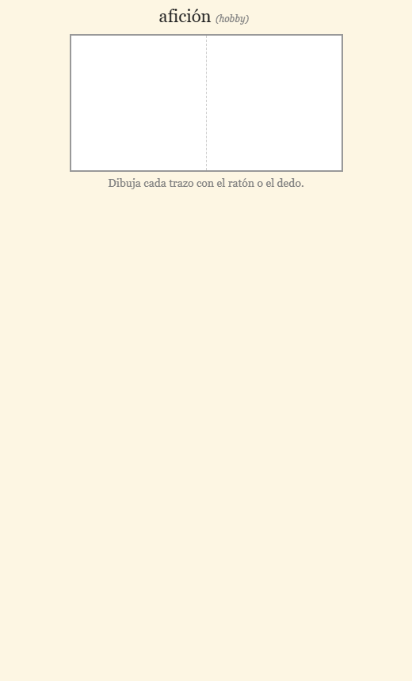
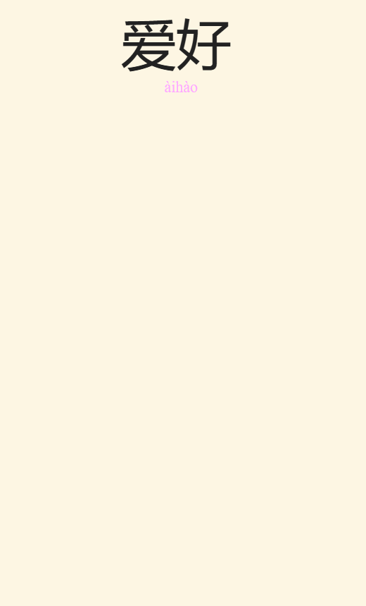
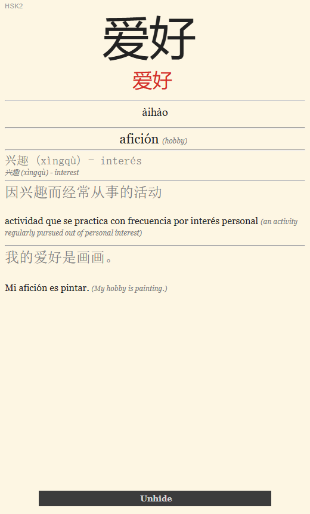
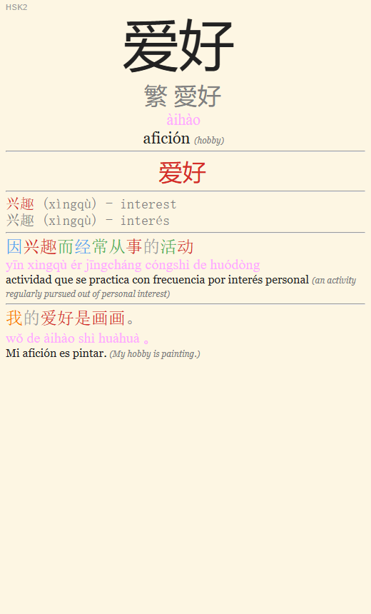

# Zhongwen Anki

Mazos de Anki para aprender el vocabulario chino del **HSK 3.0 (niveles 1 a 4)**, pensados para **hispanohablantes**: los significados, las traducciones y la interfaz de las tarjetas están en español, con el inglés como apoyo. Cada palabra incluye hanzi, pinyin, significado, una frase de ejemplo, sinónimos y una definición breve en chino, con los caracteres coloreados por tono. Hay tarjetas para leer, escribir el pinyin y dibujar los caracteres trazo a trazo.

> **Not a Spanish speaker?** Every word also has its meaning, example sentence, synonyms and definition in English, so the decks can be adapted to any language starting from the English columns. See [Adaptarlo a otro idioma / Adapting it to another language](#adaptarlo-a-otro-idioma--adapting-it-to-another-language).

Para estudiar solo hace falta [Anki](https://apps.ankiweb.net/): no hay que instalar nada más.

| Significado → escribir hanzi | Hanzi + pinyin → significado | Respuesta de hanzi → pinyin | Consulta |
|---|---|---|---|
|  |  |  |  |

## Descargas

| Nivel | Palabras | Mazo | Nombre del mazo en Anki |
|---|---|---|---|
| HSK1 | 301 | [`decks/HSK1.apkg`](decks/HSK1.apkg) | `Chino - HSK1 (HSK 3.0)` |
| HSK2 | 198 | [`decks/HSK2.apkg`](decks/HSK2.apkg) | `Chino - HSK2 (HSK 3.0)` |
| HSK3 | 499 | [`decks/HSK3.apkg`](decks/HSK3.apkg) | `Chino - HSK3 (HSK 3.0)` |
| HSK4 | 997 | [`decks/HSK4.apkg`](decks/HSK4.apkg) | `Chino - HSK4 (HSK 3.0)` |

Cada nivel contiene solo las palabras **nuevas** de ese nivel, así que se pueden importar varios a la vez. Cuando un carácter aparece en dos niveles es con otra lectura o acepción (还 *hái* / *huán*, 站 *zhàn* «parada» / «estar de pie»...). Todos comparten el mismo tipo de nota (`Chino - HSK (ES/EN)`), y en las respuestas de HSK2, HSK3 y HSK4 aparece en pequeño, en la esquina superior izquierda, el nivel en el que se incorporó la palabra.

## Empezar a estudiar

1. Instala [Anki](https://apps.ankiweb.net/) (Windows, macOS, Linux, Android, iOS). Si quieres sincronizar varios dispositivos, crea una cuenta de AnkiWeb.
2. Descarga los `.apkg` que quieras (en GitHub: **Code → Download ZIP**, o el enlace de la tabla).
3. En Anki Desktop: `Archivo > Importar` y elige el `.apkg`.
4. Crea los mazos filtrados del [itinerario recomendado](#itinerario-recomendado-mazos-filtrados) y estudia desde ellos.

Si al importar te aparece un nuevo tipo de nota con un sufijo (`Chino - HSK (ES/EN)-xxxxx`), es que tu Anki no ha podido fusionarlo con el que ya tenías: ver [Actualizar un mazo ya importado](#actualizar-un-mazo-ya-importado).

### Tipos de tarjeta

Cada palabra genera diez tarjetas. Los códigos usan `H` (hanzi), `P` (pinyin) y `M` (*meaning*, significado): lo que va antes del `2` es lo que se muestra y lo que va después es lo que se pide.

| Código | Se muestra | Se pide |
|---|---|---|
| `H2M` | Hanzi | Recordar el significado |
| `M2H` | Significado | **Dibujar** el hanzi trazo a trazo |
| `H2P` | Hanzi | **Escribir** el pinyin con tonos |
| `PM2H` | Pinyin + significado | **Dibujar** el hanzi trazo a trazo |
| `P2M` | Pinyin | Recordar el significado |
| `M2P` | Significado | **Escribir** el pinyin con tonos |
| `P2H` | Pinyin | **Dibujar** el hanzi trazo a trazo |
| `HM2P` | Hanzi + significado | **Escribir** el pinyin con tonos |
| `HP2M` | Hanzi + pinyin | Recordar el significado |
| `Toda la información` | Todo | Nada: es una vista de consulta |

- **Dibujar** usa [HanziWriter](https://hanziwriter.org/): valida la forma, la dirección y el orden de cada trazo, y la respuesta repite la animación del carácter correcto.
- **Escribir** admite el pinyin con **tildes** (`àihào`) o con **números** (`ai4hao4`; el tono neutro con `5`, `0` o sin número; `ü` como `ü`, `v` o `u:`). No importan las mayúsculas, los espacios ni los apóstrofos. La corrección marca los errores letra a letra y muestra la respuesta correcta en el formato que hayas usado: con números si tu respuesta tiene más números que tildes, y con tildes en caso contrario o de empate. Con el teclado español, las dos formas cuestan lo mismo de escribir.
- Las respuestas muestran además el hanzi coloreado por tono, los sinónimos, una definición en chino y una frase de ejemplo. El botón **Unhide** alterna entre la versión coloreada y la neutra y muestra el pinyin de la definición y de la frase, para intentar leerlas antes.

No hace falta estudiar las diez: son un catálogo para elegir según el momento. `Toda la información` no está pensada para repasarse, sino para hojear o consultar una palabra (ver [Tarjeta «Toda la información»](#tarjeta-toda-la-información)).

### Itinerario recomendado: mazos filtrados

El mazo de cada nivel sirve como almacén de notas, y se estudia desde un mazo filtrado por tipo de tarjeta. Así cada habilidad tiene su propia programación y las palabras nuevas entran en lotes pequeños.

1. En las opciones de cada mazo `Chino - HSKn (HSK 3.0)`, pon **tarjetas nuevas/día = 0** y **repasos máximos/día = 0**.
2. Crea un mazo filtrado (`Herramientas > Crear mazo filtrado`) por cada fila de la tabla. Pon la búsqueda de **repasos** como primer filtro (límite `9999`, orden **Orden de revisión**) y la de **nuevas** como segundo (límite de `10` a `15`, orden **Orden añadido**). Deja activado **Reprogramar tarjetas según mis respuestas**.
3. Antes de cada sesión, pulsa **Reconstruir** en cada mazo filtrado.

| Mazo filtrado | Repasos (todos los niveles) | Nuevas (nivel que estés estudiando) |
|---|---|---|
| Hanzi ← pinyin y significado | `deck:"Chino - HSK*" card:PM2H is:due` | `deck:"Chino - HSK1 (HSK 3.0)" card:PM2H is:new` |
| Pinyin ← hanzi | `deck:"Chino - HSK*" card:H2P is:due` | `deck:"Chino - HSK1 (HSK 3.0)" card:H2P is:new` |
| Pinyin ← significado | `deck:"Chino - HSK*" card:M2P is:due` | `deck:"Chino - HSK1 (HSK 3.0)" card:M2P is:new` |
| Significado ← hanzi y pinyin | `deck:"Chino - HSK*" card:HP2M is:due` | `deck:"Chino - HSK1 (HSK 3.0)" card:HP2M is:new` |

Cuando termines un nivel, cambia `HSK1` por el siguiente en la búsqueda de nuevas. Estas cuatro rutas cubren el recuerdo gráfico, la producción del pinyin y la comprensión. Para entrenar otra dirección, crea otro mazo filtrado con el mismo patrón y el código correspondiente (`M2H`, `P2H`, `H2M`...). Las búsquedas para copiar y pegar están en [`docs/tarjetas/template_mazos.txt`](docs/tarjetas/template_mazos.txt).

### Tarjeta «Toda la información»

Anki crea una tarjeta por cada plantilla y cada nota, así que `Toda la información` añade una tarjeta más por palabra (casi 2.000 entre los cuatro niveles). Con el itinerario recomendado no molesta, porque el mazo principal tiene 0 nuevas y 0 repasos al día y ningún mazo filtrado la incluye. Si estudias directamente desde el mazo principal, suspéndelas desde el explorador con la búsqueda `card:"Toda la información"` (seleccionar todas → **Suspender**). Para consultarlas, ábrelas desde el explorador o crea un mazo filtrado con esa búsqueda y la reprogramación **desactivada**.

### Actualizar un mazo ya importado

Vuelve a importar el `.apkg` nuevo: cada palabra conserva su identificador (GUID), así que Anki actualiza las notas existentes y mantiene tu progreso.

**Si la versión nueva cambia la estructura del tipo de nota** (añade campos o tipos de tarjeta), hay que activar en el diálogo de importación la opción **Merge note types** (fusionar tipos de nota; Anki 23.10 o posterior):

- Sin ella, Anki no puede aplicar la nueva estructura a tus notas: crea un segundo tipo de nota con un sufijo (`Chino - HSK (ES/EN)-xxxxx`) y no actualiza las notas que ya tenías.
- Con ella, añade los campos y tipos de tarjeta nuevos al tipo de nota que ya tienes, y genera las tarjetas nuevas de cada palabra.
- Fusionar cambia la estructura de tu colección, así que **la siguiente sincronización con AnkiWeb será completa**: Anki te pedirá subir tu colección y sustituir la de AnkiWeb. Antes de importar, sincroniza todos tus dispositivos (móvil incluido) para no perder repasos hechos en ellos, y después elige **Subir a AnkiWeb**.
- Si la versión nueva solo cambia el diseño o el contenido de las tarjetas, no hace falta la opción ni hay sincronización completa.

> **Cambios en la versión 0.4.0, que requieren *Merge note types*:** se añaden los tipos de tarjeta `P2H`, `HM2P`, `HP2M` y `Toda la información`, y los campos `SourceLevel` y `PinyinNumbered`. Además, `M2H` pasa de recordar el hanzi mentalmente a dibujarlo trazo a trazo, y `M2P` pasa a pedir que escribas el pinyin. El historial de repasos de todas las tarjetas se conserva.

## Ajustes recomendados en Anki

<details>
<summary>Configuración de mazo usada en este repositorio (ajústala a tu gusto)</summary>

```
# Límites diarios
Tarjetas nuevas/día = 5
Repasos máximos/día = 100

# Tarjetas nuevas
Pasos de aprendizaje = 1m 10m 1d 6d
Intervalo de graduación = 7
Intervalo fácil = 10
Orden de inserción = Aleatorio

# Fallos
Pasos de re-aprendizaje = 10m 20m
Intervalo mínimo = 2
Umbral de sanguijuela = 5
Acción de sanguijuela = Solo etiquetar

# Avanzado
Intervalo máximo = 365
Facilidad inicial = 2.50
Bonus fácil = 1.30
Modificador de intervalo = 1.10
Intervalo difícil = 1.20
Nuevo intervalo = 0.80
```
</details>

Complementos recomendados: **[Auto Ease Factor](https://ankiweb.net/shared/info/1672712021)** o **[Reset Ease](https://ankiweb.net/shared/info/947935257)** (evitan la «ease hell») y **[Review Heatmap](https://ankiweb.net/shared/info/1771074083)** (visualiza tu constancia).

Más trucos (barajar las nuevas, empezar de cero, ritmo de nuevas por habilidad): [`docs/FUNCIONALIDADES.md`](docs/FUNCIONALIDADES.md).

## Adaptarlo a otro idioma / Adapting it to another language

Los mazos están hechos para hispanohablantes, pero cada palabra de `data/hskN/input.tsv` tiene también su significado, frase de ejemplo, sinónimos y definición **en inglés** (columnas `Meaning`, `SentenceMeaning`, `Synonyms` y `DictionaryMeaning`). Para adaptarlo a otro idioma:

1. Añade al `input.tsv` las columnas traducidas a tu idioma con su sufijo, por ejemplo `MeaningFR`, `SentenceMeaningFR`, `SynonymsFR` y `DictionaryMeaningFR` para francés. Lo más práctico es pedírselo a un LLM a partir de las columnas en inglés (en [`CONTRIBUTING.md`](CONTRIBUTING.md#otro-idioma-de-destino) hay un prompt).
2. Traduce los pocos textos fijos de las plantillas de `card_template/` («Dibuja cada trazo con el ratón o el dedo.», el contador de caracteres, `繁`, «Unhide»).
3. Genera los mazos con `zhongwen-anki-build-all --target-lang FR`.

*The decks are made for Spanish speakers, but every word in `data/hskN/input.tsv` also has its meaning, example sentence, synonyms and definition in English (`Meaning`, `SentenceMeaning`, `Synonyms`, `DictionaryMeaning`). To adapt them to your language: (1) add columns translated from the English ones with your language suffix, e.g. `MeaningFR`, `SentenceMeaningFR`, `SynonymsFR`, `DictionaryMeaningFR` (an LLM prompt is in [`CONTRIBUTING.md`](CONTRIBUTING.md#otro-idioma-de-destino)); (2) translate the few fixed texts in the `card_template/` HTML files; (3) build with `zhongwen-anki-build-all --target-lang FR` after installing as described below.*

## Generar o ampliar los mazos

Hace falta Python 3.10 o superior:

```bash
git clone <url-de-tu-fork>
cd zhongwen-anki
python -m venv .venv
.venv\Scripts\activate       # Windows; en macOS/Linux: source .venv/bin/activate
pip install -e ".[deck,test]"

zhongwen-anki-build-all      # regenera data/*/output.tsv y decks/*.apkg
```

| Comando | Qué hace |
|---|---|
| `zhongwen-anki-build-all` | Regenera todos los niveles de una vez (o algunos, con `--levels HSK2 HSK3`) |
| `zhongwen-anki` | Enriquece un `input.tsv`: pinyin de frases y definiciones, coloreado por tono |
| `zhongwen-anki-build-deck` | Empaqueta un `output.tsv` en un `.apkg` |
| `zhongwen-anki-export-stats` | Exporta tu historial de repasos de Anki a CSV |
| `zhongwen-anki-analyze-stats` | 🚧 Genera un informe HTML a partir de ese CSV |

Cómo funciona el pipeline, cómo añadir vocabulario o un nivel (con el prompt para el LLM), cómo adaptarlo a otro idioma y cómo están organizadas las plantillas: [`CONTRIBUTING.md`](CONTRIBUTING.md).

## Analizar tu progreso

```bash
zhongwen-anki-export-stats --deck "HSK1" -o docs/local/estadisticas/anki_reviews.csv
zhongwen-anki-analyze-stats -i docs/local/estadisticas/anki_reviews.csv -o docs/local/estadisticas/report.html
```

El primero exporta cada repaso (acierto o fallo, tipo de tarjeta, etiquetas, tiempo, intervalo) desde el `collection.anki2` local. El segundo genera un informe HTML autocontenido con la precisión por tipo de tarjeta y por nivel, la tendencia de aciertos, la retención por intervalo, la precisión por día de la semana y las palabras más difíciles. **Es trabajo en curso**: está probado con datos sintéticos, pero todavía no con un historial real largo.

Si estudias sobre todo en AnkiDroid, sincroniza AnkiDroid → AnkiWeb → Anki Desktop antes de exportar. Más detalle en [`docs/FUNCIONALIDADES.md`](docs/FUNCIONALIDADES.md).

## Créditos y licencia

Basado en [`zhongwen-anki`](https://github.com/thomashirtz/zhongwen-anki) de Thomas Hirtz. Las tarjetas de escritura usan [HanziWriter](https://hanziwriter.org/) (MIT) y datos de trazos derivados de [Make Me a Hanzi](https://github.com/skishore/makemeahanzi) (Arphic Public License; ver [`vendor/hanzi-writer/NOTICE.md`](vendor/hanzi-writer/NOTICE.md)). Para construir listas de vocabulario mientras navegas es útil la extensión [Zhongwen](https://github.com/cschiller/zhongwen).

Distribuido bajo licencia MIT; ver [`LICENSE`](LICENSE).
